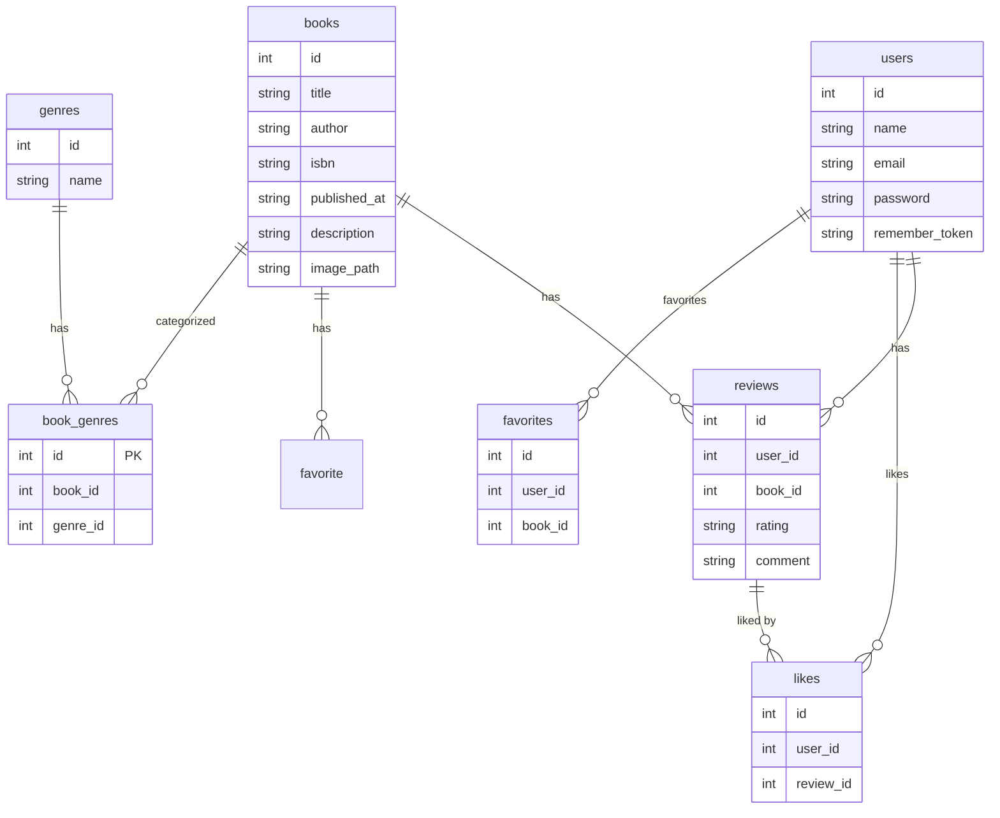

```mermaid
erDiagram
  users {
    int id
    string name
    string email
    string password
    string remember_token
  }

  books {
    int id
    string title
    string author
    string isbn
    string published_at
    string description
    string image_path
  }

  reviews {
    int id
    int user_id
    int book_id
    string rating
    string comment
  }

  likes {
    int id
    int user_id
    int review_id
  }

  favorites{
    int id
    int user_id
    int book_id
  }

  genres{
    int id
    string name
  }

  book_genres {
    int id PK
    int book_id
    int genre_id
  }

    users ||--o{ reviews : "has"
    users ||--o{ likes : "likes"
    users ||--o{ favorites : "favorites"

    books ||--o{ reviews : "has"
    books ||--o{ favorite : "has"
    books ||--o{ book_genres : "categorized"

    reviews ||--o{ likes : "liked by"

    genres ||--o{ book_genres : "has"
```
