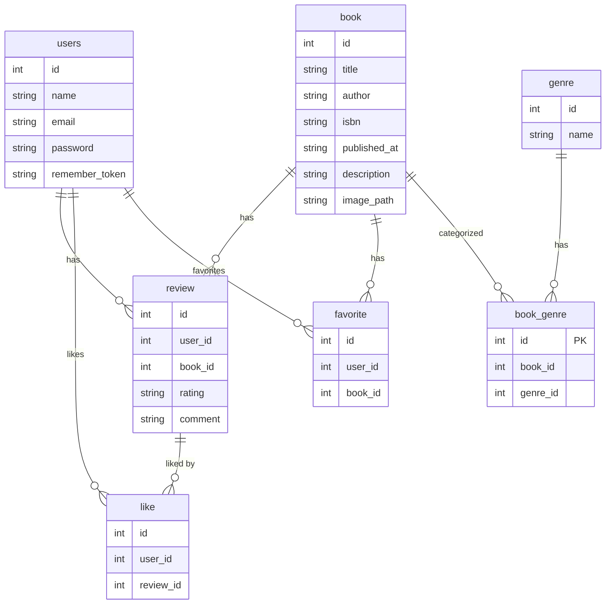

```mermaid
erDiagram
  users {
    int id
    string name
    string email
    string password
    string remember_token
  }

  book {
    int id
    string title
    string author
    string isbn
    string published_at
    string description
    string image_path
  }

  review {
    int id
    int user_id
    int book_id
    string rating
    string comment
  }

  like {
    int id
    int user_id
    int review_id
  }

  favorite{
    int id
    int user_id
    int book_id
  }

  genre{
    int id
    string name
  }

  book_genre {
    int id PK
    int book_id
    int genre_id
  }

    users ||--o{ review : "has"
    users ||--o{ like : "likes"
    users ||--o{ favorite : "favorites"
    book ||--o{ review : "has"
    book ||--o{ favorite : "has"
    review ||--o{ like : "liked by"
    book ||--o{ book_genre : "categorized"
    genre ||--o{ book_genre : "has"
```
