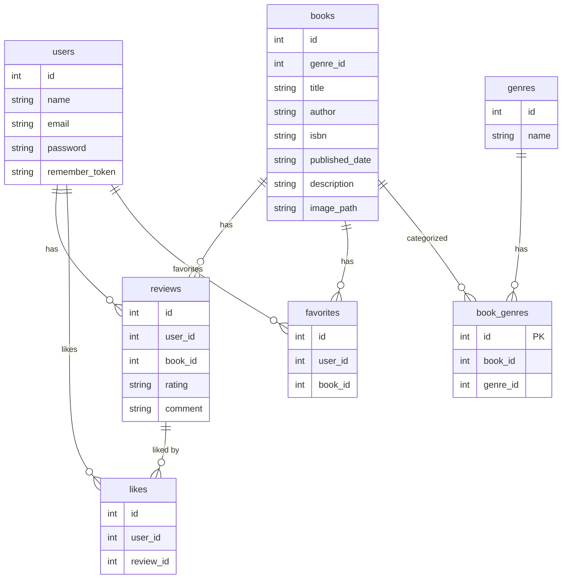

# COACHTECH Bookshelf書籍レビューアプリ

## 作成者

江草　英樹

## 使用技術

- PHP 8.5
- Laravel 10.x
- MySQL 8.4
- Nginx
- Docker / Docker Compose / Laravel Sail
- Vite / Tailwind CSS 3.4
- Laravel Fortify（認証）
- phpMyAdmin

##　ER図

🚀 環境構築手順（Setup Guide）

1. 📌 前提条件（Prerequisites）
   以下がインストールされている必要があります：

Docker Desktop

Git

（Windows の場合）WSL2 が有効化されていること

Node.js は Sail 内で動くためローカル不要（任意）

2. 📥 リポジトリのクローン
   bash
   git clone git@github.com:Denchan55/bookshelf-v2.git
   cd bookshelf-app
3. 🛠 .env の作成と設定
   bash
   cp .env.example .env
   必要に応じて以下を確認・修正：

コード
DB_CONNECTION=mysql
DB_HOST=mysql
DB_PORT=3306
DB_DATABASE=contact_form
DB_USERNAME=sail
DB_PASSWORD=password 4. 🐳 Docker（Laravel Sail）の起動
bash
./vendor/bin/sail up -d 5. 📦 依存関係のインストール
bash
./vendor/bin/sail composer install
./vendor/bin/sail npm install
./vendor/bin/sail npm run dev 6. 🔑 アプリケーションキーの生成
bash
./vendor/bin/sail artisan key:generate 7. 🗄 マイグレーション & シーディング
bash
./vendor/bin/sail artisan migrate --seed 8. 🌐 アクセス方法
アプリケーション
http://localhost/books

phpMyAdmin
http://localhost:8080

🧪 テスト実行（任意）
bash
./vendor/bin/sail artisan test
📁 ディレクトリ構成（抜粋）
コード
contact-form-app/
├── app/
├── database/
│ ├── migrations/
│ ├── seeders/
│ └── factories/
├── resources/
├── routes/
├── tests/
└── docker-compose.yml
📝 補足（Notes）
Vite のポート競合が起きた場合は npm run dev を再実行してください。

Docker の初回起動には時間がかかる場合があります。

Seeder により初期データ（タグ・管理者ユーザーなど）が自動投入されます。

🎉 完了
以上で環境構築は完了です。
アプリケーションを起動し、動作を確認してください。

## APIエンドポイント一覧

認証不要の公開APIです。全エンドポイントは `/api/v1` プレフィックス配下に定義されています。

| HTTPメソッド | URI                   | 概要     |
| ------------ | --------------------- | -------- |
| GET          | /api/v1/books         | 書籍一覧 |
| GET          | /api/v1/books/{book}  | 書籍詳細 |
| POST         | /api/v1/books         | 書籍登録 |
| PUT          | /api/v1/books/{books} | 書籍更新 |
| DELETE       | /api/v1/books/{books} | 書籍削除 |

## 通知機能の動作確認方法

本アプリでは、読書計画に応じて以下の 4 種類の通知が自動生成されます。

期限 3 日前通知
期限当日通知
期限超過通知
放置通知（一定期間更新がない場合）

通知は Laravel 標準の Notification（DatabaseChannel） を使用して
notifications テーブルに保存されます。

1. 手動で通知を生成する（採点者向け）
   本番運用ではスケジューラにより自動生成されますが、
   ローカル環境では以下のコマンドで手動実行できます。

コード
./vendor/bin/sail artisan reading-plan:notify
実行後、ログインユーザーの通知一覧ページに通知が追加されます。

2. スケジューラの動作確認（任意）
   通知の自動生成は Laravel のスケジューラ（Schedule）を使用しています。
   スケジューラに登録されたコマンドを手動で実行するには以下を使用します。

コード
./vendor/bin/sail artisan schedule:run
※ daily() 実行のため、実行タイミングによっては通知が生成されない場合があります。
※ 動作確認は上記の「手動実行」で確実に再現できます。

3. スケジューラ設定（参考）
   app/Console/Kernel.php にて、通知生成コマンドを毎日実行するよう設定しています。

php
protected function schedule(Schedule $schedule)
{
$schedule->command('reading-plan:notify')->daily();
} 4. 通知の確認方法
通知は以下の画面で確認できます。

通知一覧ページ
未読バッジ（ヘッダー）
notifications テーブル

既読ボタンを押すことで通知を既読状態にできます。
